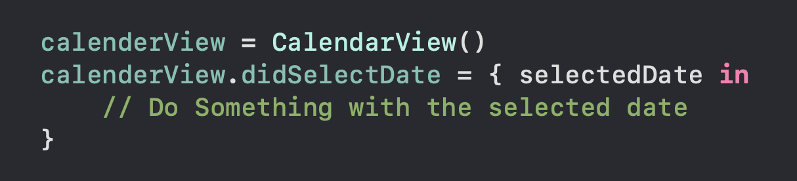

# CalenderView

## Overview
Simpel calender view built with UICollectionView.  
Just clone it and modify to your needs

## Usage
Add Calender view to your view.
You can use closure to get the selected date  
   

## Screenshot
   

## References
[Raywenderlich](https://www.raywenderlich.com/10787749-creating-a-custom-calendar-control-for-ios#toc-anchor-010)
